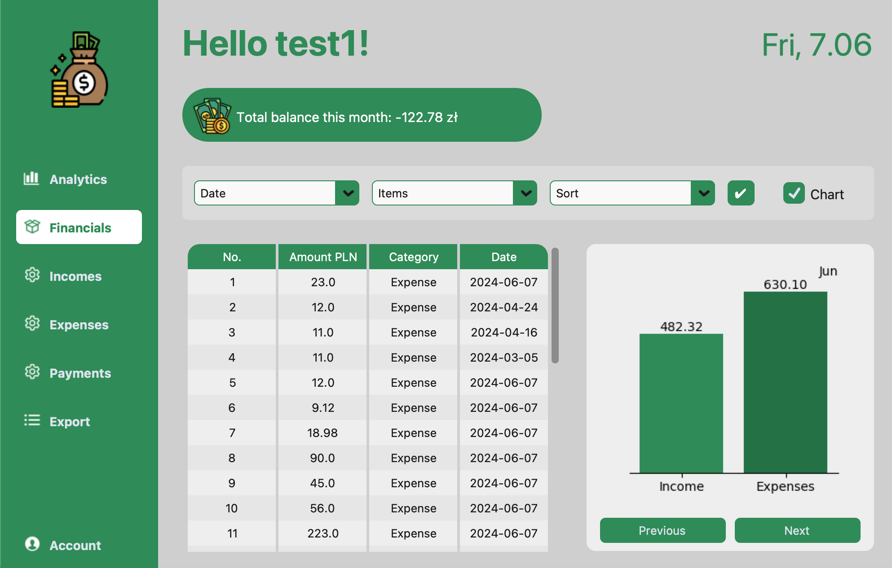
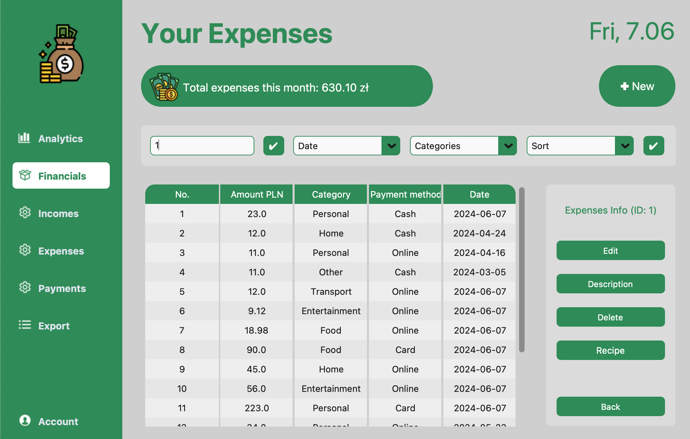
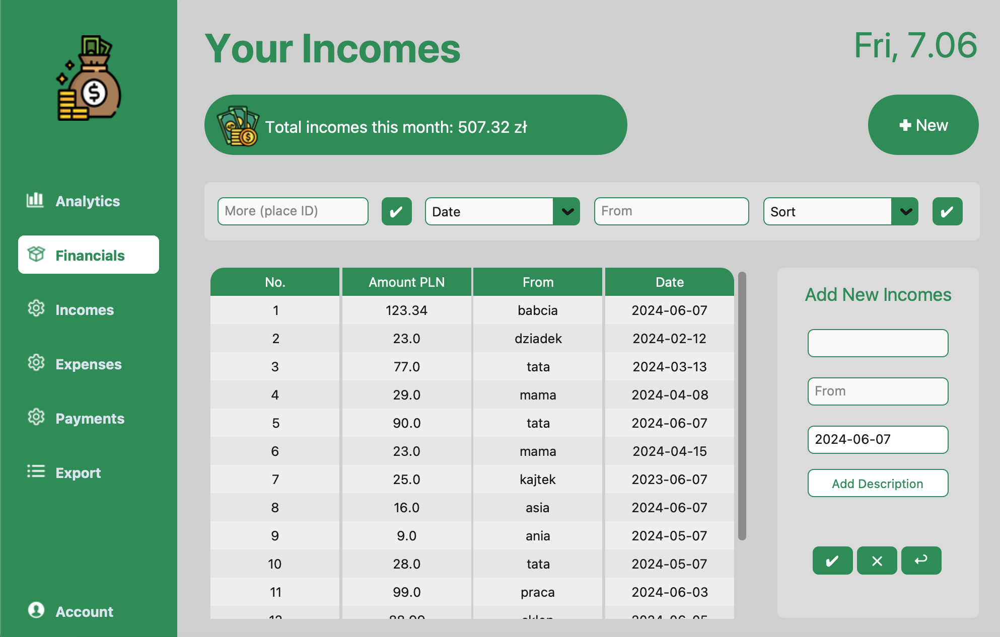

# Expense Tracker

Expense Tracker is an application designed to help you manage your expenses and incomes. It allows users to track their finances by adding expenses, incomes, and scheduled payments. The application also provides functionalities for generating charts and financial analyses.

## Project overview
Page after logging in:


More info about selected expense:


Adding new income:


## Requirements

To run this project, you need to install the required libraries. All dependencies are listed in the `requirements.txt` file. To install them, run the following command:

```bash
pip install -r requirements.txt
```

## Running the Application

To run the application, follow these steps:

1. Ensure you have installed all the required libraries.
2. Run the main script of the application `app.py`.

Example:

```bash
python3 app.py
```


## Project Components

- **database.py**: Script responsible for managing the database.
- **email_sender.py**: Script for sending email notifications.
- **financials/**: Directory containing modules related to user finances, such as expenses, incomes, and payments.
  - `expense.py`: Module for handling expense-related functionality. 

  - `income.py`: Module for handling income-related functionality. 

  - `payment.py`: Module for handling payment-related functionality. 

- `user_finances.py`: Abstract base class for user finances (expenses, incomes, payments).
  - `user_expenses.py`: Module for managing user expenses. It contains the `UserExpenses` class, which inherits from `UserFinances`.
  - `user_incomes.py`: Module for managing user incomes. It contains the `UserIncomes` class, which inherits from `UserFinances`.
  - `user_payments.py`: Module for managing user payments. It contains the `UserPayments` class, which inherits from `UserFinances`.
- **gui/**: Directory containing files related to the user interface, including pages and controllers.
  - `account_page.py`: UI for user account details.
  - `charts_page.py`: UI for displaying financial charts.
  - `charts_page_controller.py`: Controller for charts page.
  - `expenses_page.py`: UI for managing expenses. It contains the `ExpensesPage` class, which inherits from `ItemPageABC`.
  - `export_page.py`: UI for exporting financial data.
  - `home_page.py`: UI for the home page.
  - `incomes_page.py`: UI for managing incomes. It contains the `IncomesPage` class, which inherits from `ItemPageABC`.
  - `item_controller.py`: Controller for items.
  - `item_page_abc.py`: Abstract base class for item pages.
  - `items_controller.py`: Controller for multiple items.
  - `login_page.py`: UI for user login.
  - `payments_page.py`: UI for managing payments. It contains the `PaymentsPage` class, which inherits from `ItemPageABC`.
  - `registration_window.py`: UI for user registration.
  - `view_manager.py`: Manages the different views in the application.
  - `widgets_and_buttons.py`: Custom widgets and buttons for the UI.
  - **images/**: Directory containing image assets used in the application.
- **utils/**: Helper modules, such as input validators and export functions.
  - `entry_validators.py`: Module for validating user input.
  - `exports.py`: Module for exporting data.
- **plots.py**: Script for generating financial plots.
- **requirements.txt**: File listing the dependencies required to run the project.
## Project Structure

The project is organized into different modules and directories. Here is an overview of the project structure:

```plaintext
├── financials
│   ├── expense.py
│   ├── income.py
│   ├── payment.py
│   ├── user_expenses.py
│   ├── user_finances.py
│   ├── user_incomes.py
│   └── user_payments.py
├── gui
│   ├── account_page.py
│   ├── charts_page.py
│   ├── charts_page_controller.py
│   ├── expenses.db
│   ├── expenses_page.py
│   ├── export_page.py
│   ├── home_page.py
│   ├── incomes_page.py
│   ├── item_controller.py
│   ├── item_page_abc.py
│   ├── items_controller.py
│   ├── login_page.py
│   ├── payments_page.py
│   ├── registration_window.py
│   ├── view_manager.py
│   └── widgets_and_buttons.py
└── utils
    ├── entry_validators.py
    └── exports.py
├── plots.py
├── user.py
├── database.py
├── email_sender.py
```
## Requirements
- Python==3.6+
- CTkTable==1.1
- customtkinter==5.2.2
- matplotlib==3.8.0
- numpy==1.26.4
- openpyxl==3.0.10
- pandas==2.2.2
- Pillow==10.3.0
- tkcalendar==1.6.1

## Running email notifications
To run email notifications, you need to set up an email account and provide the necessary credentials in the `email_sender.py` script. You can use a Gmail account to send emails. Make sure to enable "Less secure app access" in your Google account settings to allow the application to send emails.

To run the email notifications independently, you can plan it in cron or task scheduler.

Set environment variables for the email and password:
```bash
export EMAIL_ADDRESS="your_email_address"
export EMAIL_PASSWORD="your_email_password"
```

Open cron by typing `crontab -e` in the terminal and add the following line to run the script every day at 8 AM:

```bash
0 8 * * * python3 /path/to/email_sender.py
```


## Usage

The application is designed to be easy to use. After setting up the environment and installing the dependencies, you can start adding your financial data and generating reports.


